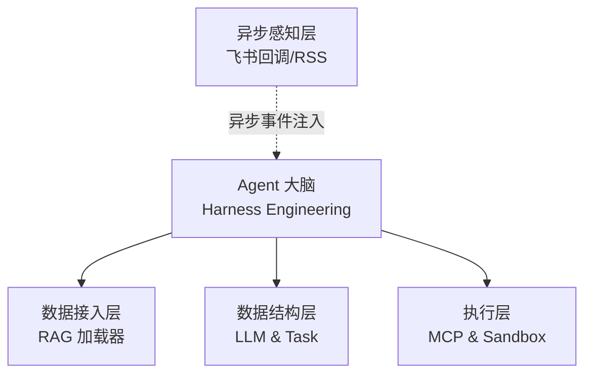

# 架构介绍

CatInCup 采用极致的解耦设计，核心代码位于 `src/` 目录：

```
src/
├── agent/          # Agent 核心大脑：包含 Harness Engineering 调度逻辑与状态机
├── loader/         # 数据接入层：数据库连接与本地记忆 RAG 加载器
├── models/         # 数据结构层：面向对象定义，包括 LLM 模型基类与子任务 (Task) 抽象
├── plugins/        # 工具与执行层：MCP 集成、原生插件系统、本地文件白名单校验及 Docker 沙盒调度
├── sensor/         # 异步感知层：环境状态监听（如飞书回调、RSS 流等消息注入）
└── utils/          # 基础设施层：通用工具函数库、日志与重试机制
```

## 架构拓扑图



## 演进路线图 (Roadmap)

1. **核心引擎优化**：打磨 Harness Engineering，提升 KV Cache 命中率，进一步压降 Token 消耗。
    
2. **多模型与高可用**：深度适配主流开源/闭源模型，加入 API 故障自动转移与混合调度。
    
3. **多模态融合**：接入视觉/听觉等多模态大模型接口，拓展操作边界。
    
4. **分布式执行**：支持跨节点 Docker 容器调度，应对高并发与重度任务计算。
    
5. **生态与记忆系统**：搭建标准化的插件/Skill 市场；研发超越传统 RAG 的长效结构化记忆检索树。