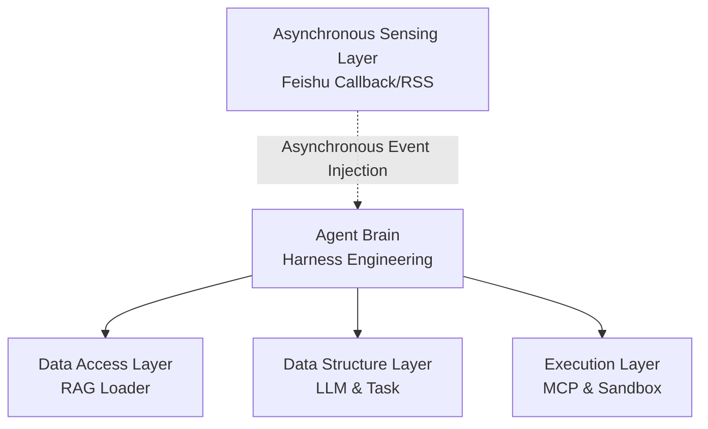

# Architecture Introduction

CatInCup adopts an extremely decoupled design, with core code located in the `src/` directory:

```
src/
├── agent/          # Agent core brain: contains Harness Engineering scheduling logic and state machine
├── loader/         # Data access layer: database connections and local memory RAG loader
├── models/         # Data structure layer: object-oriented definitions, including LLM model base classes and subtask (Task) abstractions
├── plugins/        # Tool and execution layer: MCP integration, native plugin system, local file whitelist verification, and Docker sandbox scheduling
├── sensor/         # Asynchronous sensing layer: environmental status monitoring (such as Feishu callbacks, RSS feeds, etc.)
└── utils/          # Infrastructure layer: common utility functions, logging, and retry mechanisms
```

## Architecture Topology



## Roadmap

1. **Core Engine Optimization**: Polish Harness Engineering, improve KV Cache hit rate, and further reduce Token consumption.
    
2. **Multi-Model and High Availability**: Deeply adapt to mainstream open source/closed source models, add API failure automatic transfer and hybrid scheduling.
    
3. **Multi-Modal Fusion**: Access visual/audio and other multi-modal large model interfaces to expand operation boundaries.
    
4. **Distributed Execution**: Support cross-node Docker container scheduling to handle high concurrency and heavy task computing.
    
5. **Ecosystem and Memory System**: Build a standardized plugin/Skill market; develop long-term structured memory retrieval trees that go beyond traditional RAG.